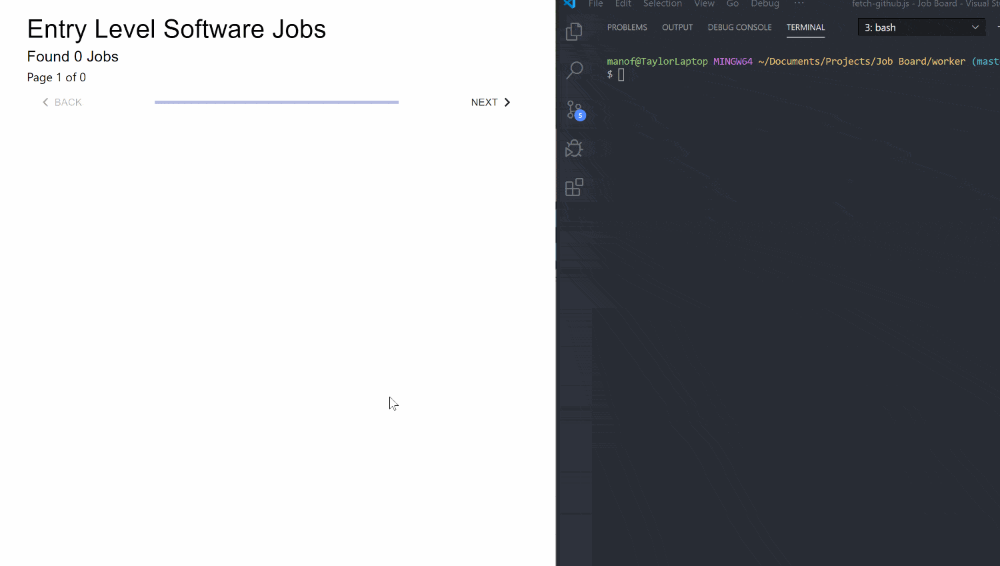

# Automated Entry Level Job Board

Automatically fetches new entry-level jobs on a cron-job timer to display on site. API Calls to GitHub Jobs to retvieve jobs, Stores API Calls and serves to Front-End with Redis Cloud Database. React Front-End with Material UI Styled Component Library, NodeJS with Express Back-End.




## Usage

1. Clone repository & run in terminal:

```
npm install
cd api
node index.js
```
2. In main directory, run:
```
cd worker
node worker.js
```
3. In main directory, run:
```
cd client
npm install
npm start
```
4. Tweak the algorithm in /worker/tasks/fetch-github.js to tailor your results


